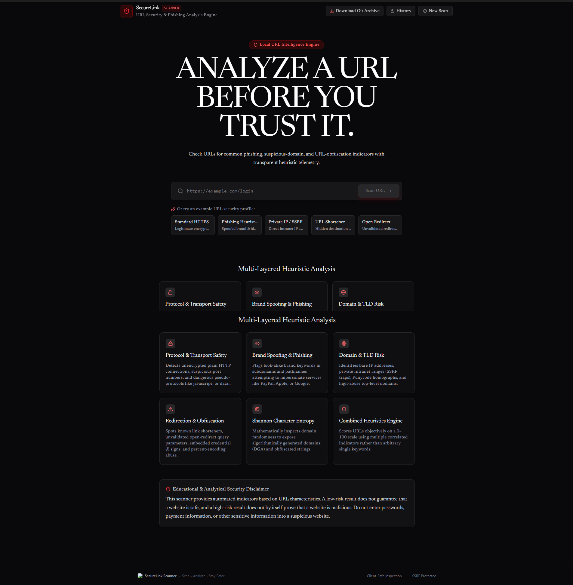

# SecureLink Scanner 🛡️

> Modern URL Security & Phishing Heuristic Analysis Engine

SecureLink Scanner is an original, client-safe URL security analysis and risk assessment tool. It inspects submitted web links, breaks down RFC 3986 components, evaluates them against multi-layered security heuristics, and outputs a transparent, explainable 0–100 risk score with detailed technical telemetry.

---

## 🖥️ User Interface



---

## 🚀 Pushing to GitHub

If you downloaded the `.tar.gz` archive, follow these simple steps to push the project to your own GitHub repository:

1. Create a new repository on [GitHub](https://github.com/new) (e.g. `securelink-scanner`).
2. Extract the archive and enter the folder:
   ```bash
   tar -xzf securelink-scanner.tar.gz
   cd applet
   ```
3. Link your GitHub remote and push:
   ```bash
   git remote add origin https://github.com/<YOUR_GITHUB_USERNAME>/<YOUR_REPO_NAME>.git
   git branch -M main
   git push -u origin main
   ```

---

## ✨ Features

- **Multi-Vector Heuristic Engine**:
  - **Protocol Inspection**: Flags unencrypted plain HTTP, suspicious ports, and dangerous pseudo-protocols (`javascript:`, `data:`, `vbscript:`).
  - **Domain & Brand Masquerading**: Detects look-alike brand spoofing (e.g. PayPal, Apple, Google, Microsoft, Banks) in subdomains and root domains.
  - **IP & SSRF Detection**: Identifies direct raw IP addresses and isolates private/intranet addresses (`127.0.0.1`, RFC 1918, `169.254.169.254` Cloud metadata).
  - **TLD Threat Profiling**: Flags high-abuse and disposable top-level domains (`.zip`, `.mov`, `.xyz`, `.top`, etc.).
  - **Redirection & Obfuscation**: Exposes known link shorteners, unvalidated open-redirect parameters (`?redirect=`), credential masking (`@` delimiter), and percent-encoding abuse.
  - **Shannon Character Entropy**: Calculates mathematical character randomness to flag algorithmically generated domains (DGA).
  - **Keyword Concentration**: Analyzes authentication urgency terms without naive single-keyword false positives.
- **Explainable 0–100 Risk Scoring**:
  - `0 – 30`: Low Risk
  - `31 – 60`: Medium Risk
  - `61 – 80`: High Risk
  - `81 – 100`: Critical Risk
  - Transparent itemized breakdown showing exact point additions (+0, +10, +20, etc.).
- **Interactive Security Dashboard**:
  - Real-time status cards (Passed ✓, Warning ⚠, Danger ✕).
  - Filter by All, Issues, or Passed checks.
  - Parsed RFC 3986 URL metrics (Protocol, Domain, Subdomain, Port, Path, Query parameters, Length).
- **Expandable Technical Analysis**:
  - Shannon Entropy gauge with bits/char readout.
  - Obfuscation matrix, Punycode/IDN inspection, and analyst recommendations.
- **Local Scan History**:
  - Stored in browser `localStorage`.
  - Search, reopen, delete individual entries, or clear all history.
- **Export & Reports**:
  - 1-click clipboard summary copy.
  - Download formatted plain text report (`.txt`).
  - Download structured machine-readable report (`.json`).
- **Full-Stack Architecture & SSRF Protection**:
  - Express server with `POST /api/scan` endpoint.
  - Robust SSRF filters blocking requests to internal loops or link-local endpoints.
  - Client-safe fallback so analysis works seamlessly anywhere.

---

## 🚀 Getting Started

### Prerequisites

- Node.js (v18 or higher recommended)
- npm

### Installation

```bash
npm install
```

### Running Locally

```bash
npm run dev
```

Open `http://localhost:3000` in your browser.

### Building for Production

```bash
npm run build
npm start
```

---

## 📡 API Endpoint

### `POST /api/scan`

Analyzes a target URL with server-side SSRF validation.

**Request:**
```json
{
  "url": "https://example.com/login"
}
```

**Response:**
```json
{
  "url": "https://example.com/login",
  "score": 10,
  "riskLevel": "Low",
  "isInternalNetworkTarget": false,
  "checks": [...],
  "details": {...},
  "factors": [...],
  "analysisEngine": "Local URL Analysis",
  "recommendations": [...]
}
```

---

## 🔒 Security Disclaimer

This scanner provides automated heuristic indicators based on URL characteristics. A low-risk result does not guarantee that a website is safe, and a high-risk result does not by itself prove that a website is malicious. Do not enter passwords, payment information, or other sensitive information into a suspicious website.
